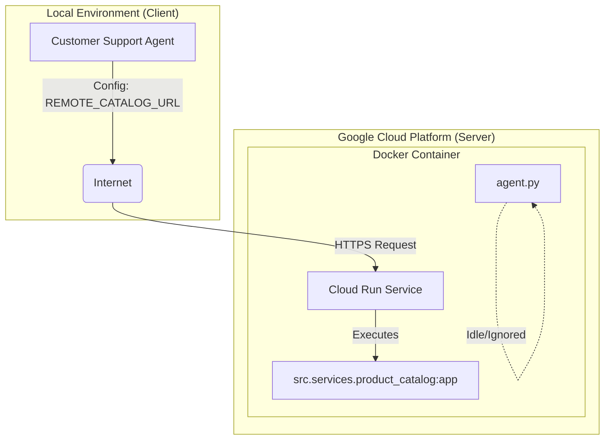

# Project Retrospective: Agent Deployment (Day 5b)

**Date:** 2025-12-02
**Topic:** Deploying Agentic Service to Google Cloud Run

## 1. 核心目标 (Objective)
将本地开发的 `Product Catalog Service` (Provider) 迁移到 Google Cloud Run，实现 Serverless 容器化部署，并让本地客户端 (Consumer) 能够通过公网访问该服务。

## 2. 架构演进 (Architecture Evolution)

从 **"Local-to-Local"** 进化为 **"Hybrid Cloud" (混合云)** 架构。

## 3. 关键实施步骤 (Implementation)

### 3.1 容器化 (Dockerization)
创建了 `Dockerfile`，核心决策如下：
*   **Base Image**: 使用 `python:3.11-slim` 保持轻量。
*   **Server**: 使用 `gunicorn` 配合 `uvicorn.workers.UvicornWorker`，这是生产环境运行 FastAPI/ASGI 应用的标准配置。
*   **Port Handling**: 必须监听 `$PORT` 环境变量（Cloud Run 自动注入，通常为 8080）。

### 3.2 构建与部署 (Build & Deploy)
放弃了本地 Docker 构建，直接使用 Google Cloud Build 链条：
1.  **Build**: `gcloud builds submit ...` (将代码打包上传至 GCR)。
2.  **Deploy**: `gcloud run deploy ...` (启动服务，注入 `GOOGLE_API_KEY`，开启 `--allow-unauthenticated`)。

### 3.3 客户端适配
修改 `config/settings.py`，增加了智能连接逻辑：
*   优先读取环境变量 `REMOTE_CATALOG_URL`。
*   默认指向 Cloud Run 的 HTTPS 地址。
*   保留回退到 `localhost:8001` 的能力，方便本地调试。

## 4. 核心知识点解析 (Deep Dive)

### 4.1 "我到底部署了什么？" (The Container Concept)
这是本项目最大的认知突破点。
*   **误区**: 认为部署上去的是“整个项目”，所有 Python 文件都在运行。
*   **真相**: 部署的是一个**镜像 (Image)**。虽然镜像里包含了项目的所有文件（包括 `agent.py`, `tests`），但容器启动时**只执行 `CMD` 指令指定的那一个进程**。
*   **比喻**: 就像开了一家餐厅（容器），虽然带了厨师（Catalog Service）和清洁工（Agent.py），但排班表（CMD）只安排了厨师工作，清洁工在后台睡觉。

### 4.2 为什么需要 Gunicorn?
*   本地开发用 `python script.py` (通常启动的是单进程 Uvicorn) 足够了。
*   生产环境需要 `Gunicorn` 作为进程管理器，它能更好地处理并发、重启崩溃的 Worker，并提供更稳健的请求处理能力。

## 5. 遇到的挑战与解决方案 (Challenges)

| 挑战 | 原因 | 解决方案 |
| :--- | :--- | :--- |
| **SSL 证书错误** | Windows 环境下 Python 找不到根证书 | 在 `Dockerfile` 和代码中显式设置 `SSL_CERT_FILE` 指向 `certifi` 路径。 |
| **服务无法启动** | Cloud Run 找不到 `app` 对象 | 重构 `product_catalog.py`，确保在模块导入模式下也能初始化 `app` 实例。 |
| **客户端连不上** | URL 硬编码为 localhost | 引入 `settings.py` 集中管理配置，支持环境变量覆盖。 |

## 6. 未来规划 (Next Steps)

1.  **CI/CD 流水线**: 配置 `cloudbuild.yaml`，连接 GitHub 仓库，实现代码提交即自动部署。
2.  **镜像瘦身**: 添加 `.dockerignore` 文件，排除 `tests`, `.git`, `__pycache__/` 等无关文件，减小镜像体积。
3.  **多服务部署**: 如果未来需要运行 `agent.py`，需要编写独立的 Dockerfile 或修改启动命令，将其部署为第二个 Cloud Run 服务。
