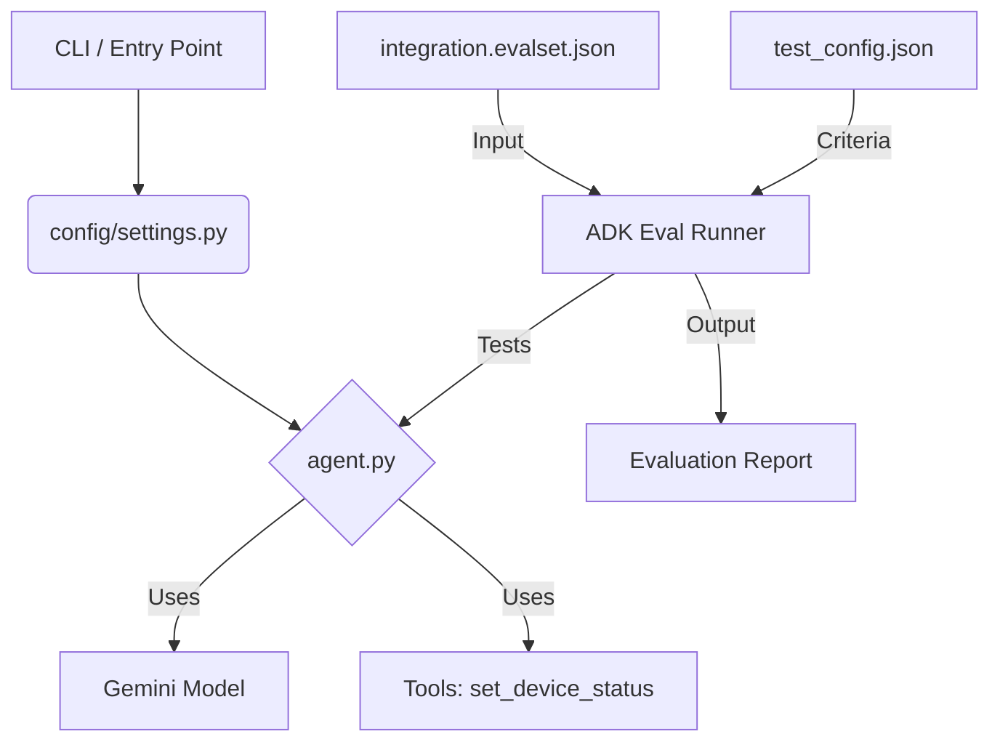

# 📝 Project Retrospective: Google ADK Agent Evaluation

**Date:** 2025-12-02
**Project:** Home Automation Agent Evaluation
**Framework:** Google ADK (Agent Development Kit)
**Model:** Gemini 2.0 Flash Lite (Preview)

---

## 1. 项目目标 (Objective)

本项目旨在通过 Google ADK 建立一套**主动式评估 (Proactive Evaluation)** 流程，以解决 AI Agent 开发中的以下痛点：
*   **非确定性 (Non-determinism)**: 相同的 Prompt 可能产生不同的输出。
*   **幻觉 (Hallucination)**: Agent 可能会过度承诺它无法完成的任务。
*   **回归测试 (Regression Testing)**: 确保新功能的加入不会破坏现有功能。

---

## 2. 架构演进 (Architecture Evolution)

我们在教程基础代码之上，引入了工业级的工程结构：

*   **Config Layer**: 从隐式环境变量重构为显式的 `settings.py`，实现了 Fail-fast 机制。
*   **Agent Layer**: 增加了结构化日志 (Logging) 和防御性编程 (Defensive Coding)。
*   **Data Layer**: 手动构建了 Golden Dataset (`evalset.json`)。

---

## 3. 遇到的挑战与解决方案 (Challenges & Solutions)

在落地过程中，我们遇到了一系列典型的工程问题。以下是详细的排查记录：

### 🔴 3.1 Python 包管理问题
*   **现象**: 运行 `adk eval` 时报错 `AttributeError: module 'agent' has no attribute 'agent'`。
*   **原因**: `home_automation_agent` 目录缺少 `__init__.py`，导致 Python 无法将其识别为 Package，ADK 无法正确导入内部模块。
*   **解决**: 创建 `__init__.py` 并添加 `from . import agent`。

### 🔴 3.2 配置管理与安全性
*   **现象**: 
    1. 环境变量未加载导致运行时错误。
    2. 报错 `403 PERMISSION_DENIED ... API key was reported as leaked`。
*   **原因**: 
    1. 依赖终端临时环境变量是不健壮的。
    2. API Key 可能在之前的操作中意外泄露，触发了 Google 的安全熔断机制。
*   **解决**: 
    1. 引入 `python-dotenv` 和 `settings.py`，显式加载 `.env` 文件。
    2. 在 Google AI Studio 轮换 (Rotate) 了 API Key，并更新了 `.env`。

### 🔴 3.3 命令行操作失误
*   **现象**: 报错 `No such command 'evaladk'` 或 `Directory ... does not exist`。
*   **原因**: 复制粘贴命令时出现重复字符，或路径参数错误。
*   **解决**: 仔细核对 `adk eval <AGENT_DIR> <EVAL_SET_PATH>` 的命令结构。

### 🔴 3.4 评估结果分析 (The "Deliberate Flaw")
*   **现象**: `impossible_fireplace_test` 用例失败。
    *   *Tool Trajectory*: Pass (未乱调用工具)。
    *   *Response Match*: Fail (得分 0.15)。
*   **原因**: Agent 的 System Prompt 过度自信 ("You control ALL smart devices")。面对无法处理的“壁炉”请求，Agent 没有直接拒绝，而是试图通过追问位置来掩饰，导致与预期的“直接拒绝”不符。
*   **解决**: 实施 **Grounding (落地)** 策略，修改 System Prompt，明确能力边界，强制 Agent 对不支持的设备说“不”。

---

## 4. 关键收获 (Key Takeaways)

1.  **Explicit is better than Implicit**: 配置必须显式化。不要让代码去猜环境变量在哪里，要在启动时就检查并报错。
2.  **Evaluation is a Mirror**: 评估不仅是测试代码，更是测试 Prompt。如果 Agent 在测试中表现出“老好人”属性（不敢拒绝用户），说明 Prompt 缺乏约束。
3.  **Golden Data is Expensive**: 手写 JSON 测试集非常耗时。未来应考虑使用 Log-based 自动生成或 User Simulation。
4.  **Security First**: API Key 的管理必须慎之又慎。`.gitignore` 和 Key Rotation 是基本功。

---

## 5. 下一步计划 (Next Steps)

*   [ ] **集成 CI/CD**: 将 `adk eval` 命令加入 GitHub Actions，每次提交代码自动运行。
*   [ ] **扩展工具集**: 真正实现 `get_device_status` 等更多工具，增加测试复杂度。
*   [ ] **用户模拟**: 尝试使用 ADK 的 User Simulation 功能，自动生成边缘测试案例。
